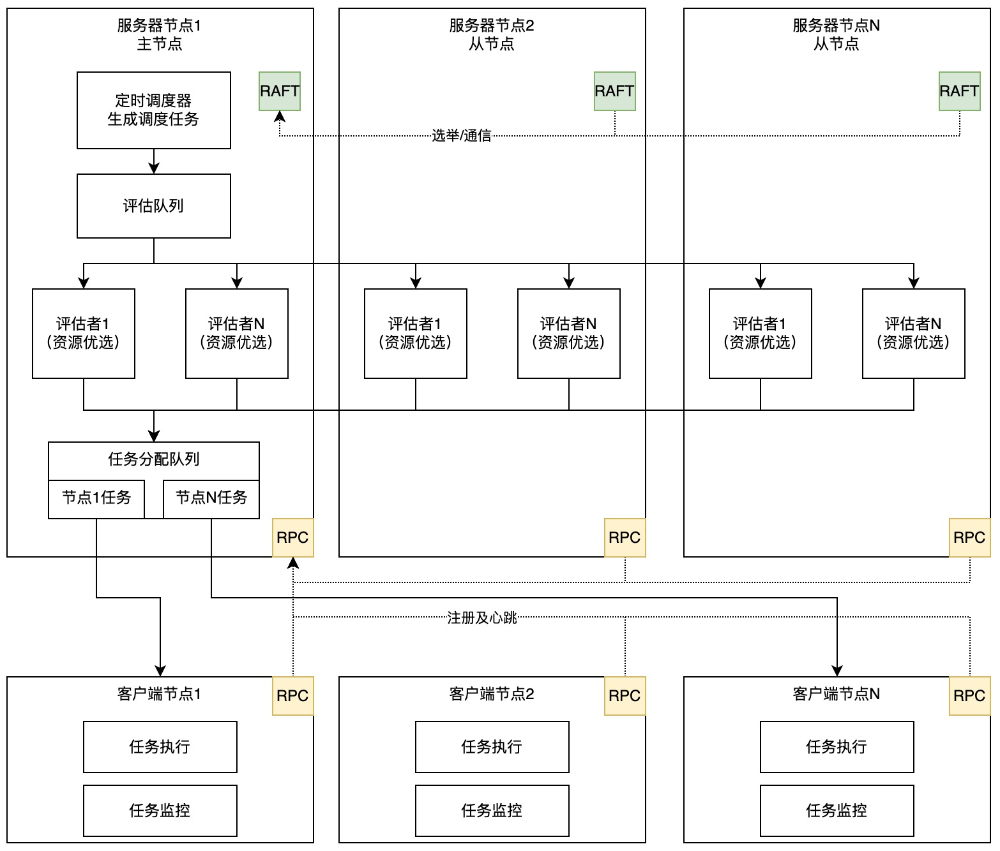

# jobpool

**注意**:  `master` 分支可能处于 *开发中状态* 。 获取稳定版本，请参见 [releases][github-release] 版本.


jobpool 是一款基于RAFT协议的调度引擎，对比其他调度软件，该项目有如下特性:

* *Raft协议*: 主节点通过Raft协议进行选举并确认主节点
* *共享状态式*: 调度协调器采用共享状态式，使用Raft进行状态同步，领导者节点负责协调，其他主节点完成调度
* *高可扩展*: 调度器和执行器均可横向扩展，适配大规模调度场景
* *高可用*: 主节点和客户端具备高可用特性，支持节点下线后的任务迁移等场景

jobpool 是使用Go语言编写，并使用 [Raft][] 共识算法来完成日志复制的高可用调度框架。

jobpool 致力于解决目前大部分项目中的缺陷：

* 任务整体运行情况缺乏整体视图呈现
* 分布式一致性较弱，存在单点或瓶颈（如Quartz的分布式锁问题、数据库持久化的性能瓶颈问题等）
* 调度器本身的横向扩展，大规模任务量的情况下调度引擎期望更多的服务器节点参与调度任务的资源评估和计算

本项目致力于解决这些问题，并提供：
* 统一的视图展现作业地图（总槽位信息、运行中的作业、待运行的作业等）
* 基于RAFT协议的分布式集群，无单点故障；
* 可扩展的调度控制器，可弹性横向扩展；
* 乐观并发的共享状态调度器，所有服务器都可以并行地参与调度决策。主节点提供额外的协调功能，这是实现并发决策，并确保客户端不会产生过量订阅所不可缺少的能力。

## 项目整体架构

工程中，分为服务器节点和客户端节点，其中服务器节点包含调度器，客户端节点负责任务执行，节点之间通过RPC通信。



* server节点组成集群，并通过RAFT协议进行选举
* leader节点负责生成定时调度任务，并将任务写入队列，队列只存活于leader节点内存中
* server节点可以开启N个评估者，从队列中获取任务并将其分配到执行器
* client节点通过RPC将其注册到服务器集群中，并定时上报心跳信息
* client节点运行执行器，从服务器中获取本节点需要运行的任务并运行，该节点负责任务的监控

## 开始使用

### 获取 jobpool

获取 jobpool 的最简单方法是使用已编译发布二进制文件，该文件可用于OSX、Linux、Windows和Docker[release page][github-release].

也可以获取项目最新源码 [build the latest version of jobpool][dl-build] 位于 `master` 分支。 源码编译方式，首先需要安装 [*Go*](https://golang.org/) 环境 ([version 1.16+](/go.mod#L3) )。所有的开发工作均在分支 `master` 上进行，包含新特性和问题修复。

源码下载和编译步骤如下
```bash
git clone https://github.com/yunlizhihui/jobpool.git
go mod download
go mod tidy
go mod vendor
go build
./jobpool -version
```
版本信息打印如下：
1.0.0

```bash
# 开发模式运行
./jobpool agent --dev
```

### 运行 jobpool

启动一个单节点 jobpool 服务器端节点.

```bash
./jobpool agent -config=doc/config/singleClusterServer.json
```

启动客户端节点

```bash
./jobpool agent -config=doc/config/client1.json
```
运行成功后，可访问如下地址确认：http://localhost:4646

### jobpool 端口

该项目默认使用如下端口
4646 用于http端口访问
4647 用于RPC调用
4648 用于节点选举和心跳等信息通信

### 运行一个 jobpool 集群

启动一个三节点的 jobpool 服务器端（本机模拟集群，各个server节点中配置不同端口运行）

```bash
./jobpool agent -config=doc/config/server1.json
./jobpool agent -config=doc/config/server2.json
./jobpool agent -config=doc/config/server3.json
```

启动客户端节点

```bash
./jobpool agent -config=doc/config/client1.json
./jobpool agent -config=doc/config/client2.json
```

### 如何清理历史数据

server运行将会把数据持久化到配置文件中的data_dir目录下，后续启动自动读取该路径下的数据，清理只需要将该文件夹下的内容删除即可


### 支持的功能及后续研发计划

已经支持的功能

- 命令行工具(jobpool)及基础的查询维护操作
- 主节点调度器个数配置
- 调度算法已支持随机选取节点
- 执行器（客户端）支持Rest调用
- 多空间隔离，空间级别的作业地图
- RestAPI
- 模块已划分为计划、任务、评估、分配等内容
- 调度器、执行器可扩展


后续研发计划

- 对接服务器资源监控为调度提供参考
- 服务器端集群支持K8S部署
- 客户端适配（如argo-workflow、k8s等）
- 调度算法、优选算法
- 扩充命令行工具支持更多的运维操作指令
- 安全验证


## Contact

- Bugs: [issues](https://github.com/yunlizhihui/jobpool/issues)

### License

jobpool is under the Apache 2.0 license. See the [LICENSE](LICENSE) file for details.
